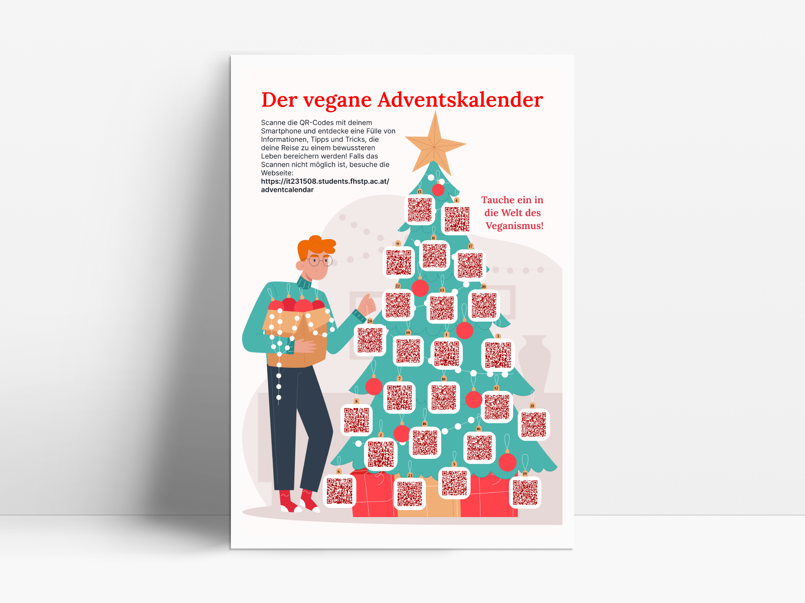
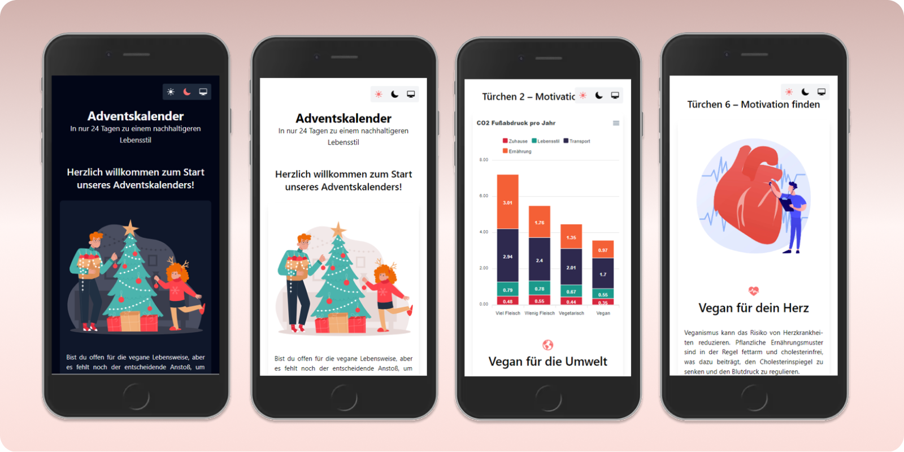

# Print to mobile – Der vegane Adventskalender

In den Supermärkten begegnen einem schon die Lebkuchen, und das heißt, die Weihnachtszeit steht bald vor der Tür. Als Student weiß ich nur allzu gut, wie knapp das Budget sein kann, besonders in der Vorweihnachtszeit. Dennoch glaube ich, dass es immer eine Möglichkeit gibt, Freude zu verbreiten, ohne die Geldbörse zu strapazieren. Der vegane Adventskalender ist ein Beispiel dafür. Er ist anders als die traditionellen Kalender, denn er ist nicht mit teuren Geschenken gefüllt, sondern mit wertvollen Informationen und nützlichen Tipps rund um das Thema Veganismus. Was meinen Adventskalender so einzigartig macht, ist seine digitale Natur – du kannst ihn jederzeit ansehen, ganz unabhängig vom Datum.

## Die Idee und das Konzept
Die Idee für diesen Adventskalender war es, jeden Tag im Dezember eine neue Information oder einen hilfreichen Tipp zum Thema Veganismus zu präsentieren. Dabei habe ich bewusst auf die Funktion verzichtet, den aktuellen Tag zu überprüfen, damit die Inhalte der Webseite im Rahmen des "Print to Mobile" Projekts immer zugänglich sind. Mein Ziel ist es, nicht nur Rezepte zu teilen, sondern auch das Bewusstsein für die Vorteile eines veganen Lebensstils zu stärken.

**Wie der Adventskalender letztlich verwendet wird, liegt im Ermessen des Nutzers oder der Nutzerin:**
- Auf dem Plakat sind 24 QR-Codes zu finden. An jedem Tag scannt man einen der nummerierten QR-Codes ein.
- Man schneidet die 24 QR-Codes aus und platziert den jeweiligen QR-Code in einem eigenen physischen Adventskalender, zusammen mit einem Geschenk oder einer süßen Leckerei.
- Oder man besucht die Webseite https://it231508.students.fhstp.ac.at/adventcalendar und klickt sich bis zum 24. Türchen durch.

## Die Umsetzung und Technologien
Für die Erstellung der Webapplikation habe ich [React](https://react.dev/) und [Tailwind CSS](https://tailwindcss.com/) verwendet. Das interaktive Säulendiagramm in Türchen 2 wurde mit [ApexCharts](https://apexcharts.com/) erstellt. Die QR-Codes wurden mithilfe von [QR Batch](https://qrbatch.com/) generiert, da man dort mehrere QR-Codes auf einmal erstellen kann. Um eine einheitliche Benutzeroberfläche zu gewährleisten, habe ich eine Basiskomponente erstellt, in die je nach ausgewähltem Türchen unterschiedliche Inhalte geladen werden. Zusätzlich habe ich die Funktionalität implementiert, um zwischen dem Light Mode, Dark Mode und dem im Betriebssystem hinterlegten Anzeigemodus umzuschalten. Der ausgewählte Modus wird im Local Storage gespeichert. Dank der `useEffect`-Hook von React aktualisiert sich der Systemmodus bei Änderungen im Betriebssystem automatisch, ohne dass die Seite neu geladen werden muss. Nicht nur die Hintergrund- und Textfarben passen sich dem ausgewählten Modus an, sondern auch die Farben des SVGs auf der Startseite.

## Mögliche Erweiterungen
Dieses Projekt bietet zahlreiche Möglichkeiten zur Erweiterung. In Zukunft könnte man interaktive Elemente hinzufügen, wie beispielsweise ein Quiz zum Thema Veganismus oder die Möglichkeit, eigene vegane Rezepte oder Feedback beizutragen. Natürlich würde es sich auch anbieten, die Inhalte des Adventskalenders jedes Jahr zu aktualisieren und zu erweitern, um eine ständig wachsende Wissensquelle zu schaffen. Darüber hinaus könnte man nach Kooperationspartnern suchen, wie zum Beispiel [Veganuary](https://veganuary.com/de/). Dieser hat viele Unterstützer, die Rabattcodes und ähnliches bereitstellen könnten, um das Projekt noch attraktiver zu gestalten.